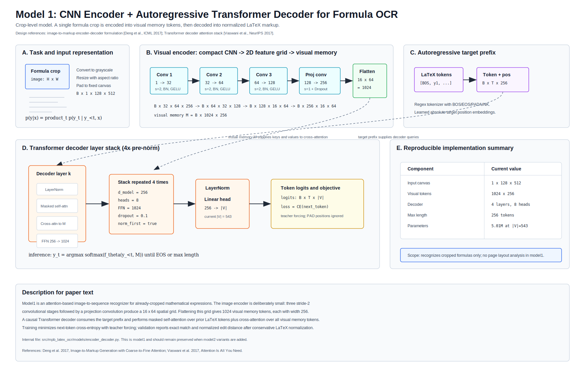
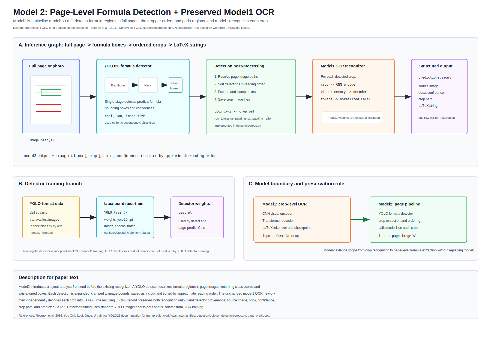

# MPB LaTeX OCR Model Architecture Notes

This document describes the current implemented models in paper-style terms. It is intentionally precise about model boundaries:

- Model1 is the preserved crop-level OCR recognizer: a compact CNN encoder plus an autoregressive Transformer decoder for cropped formula-image to LaTeX recognition.
- Model2 is the page-level YOLO formula detector plus model1 OCR pipeline. It extends scope to full-page images without replacing model1.

## Architecture Figures

Use these SVGs in papers, reports, and slide decks:

```text
docs/figures/model1_cnn_transformer_architecture.svg
docs/figures/model2_yolo_ocr_pipeline.svg
```

Model1:



Model2:



The older `docs/figures/baseline_architecture.svg` remains available for backward compatibility. For contexts that need a raster figure, use `docs/assets/model_architecture.png`.

## Reference Architecture Sources

The figures intentionally follow scientific-paper figure conventions from related OCR, sequence modeling, and detection work:

- Deng et al., 2017, "Image-to-Markup Generation with Coarse-to-Fine Attention" frames formula recognition as image-to-markup sequence generation.
- Vaswani et al., 2017, "Attention Is All You Need" supplies the Transformer decoder vocabulary: masked self-attention, cross-attention, feed-forward sublayers, and autoregressive decoding.
- Redmon et al., 2016, "You Only Look Once: Unified, Real-Time Object Detection" motivates the single-stage detector view used by the YOLO part of model2.
- Ultralytics YOLO documentation defines the practical train/predict API used by the repository's detector adapter.

## Model1: Crop-Level OCR Recognizer

## Task Formulation

Given a cropped grayscale formula image \(x \in R^{1 \times 128 \times 512}\), the model predicts a normalized LaTeX token sequence \(y = (y_1, ..., y_T)\), where \(T \le 256\). The tokenizer is a regex-based LaTeX tokenizer with explicit `<bos>`, `<eos>`, `<pad>`, and `<unk>` tokens. The current downloaded run uses a vocabulary size of 543.

The model estimates:

```text
p(y | x) = product_t p(y_t | y_<t, x)
```

Training uses teacher forcing and next-token cross-entropy. Padding positions are ignored.

## Architecture Summary

| Stage | Operation | Output shape for B x 1 x 128 x 512 |
|---|---|---|
| Input | Grayscale resize/pad and normalization to [-1, 1] | B x 1 x 128 x 512 |
| Conv block 1 | Conv2d 3x3, stride 2, pad 1, 32 channels; BatchNorm; GELU | B x 32 x 64 x 256 |
| Conv block 2 | Conv2d 3x3, stride 2, pad 1, 64 channels; BatchNorm; GELU | B x 64 x 32 x 128 |
| Conv block 3 | Conv2d 3x3, stride 2, pad 1, 128 channels; BatchNorm; GELU | B x 128 x 16 x 64 |
| Projection conv | Conv2d 3x3, stride 1, pad 1, 256 channels; BatchNorm; GELU; Dropout2d(0.1) | B x 256 x 16 x 64 |
| Flatten + projection | Flatten spatial grid, transpose to sequence, Linear 256 -> 256 | B x 1024 x 256 |
| Decoder input | Token embedding + learned position embedding | B x T x 256 |
| Transformer decoder | 4 pre-norm decoder layers; 8 attention heads; FFN 1024; GELU; dropout 0.1 | B x T x 256 |
| Output head | LayerNorm, Linear 256 -> vocab | B x T x 543 for the current tokenizer |

The CNN encoder reduces the image by a factor of 8 in both spatial dimensions. The final \(16 \times 64\) feature map is flattened into 1024 visual tokens. Each token has dimension 256 and acts as memory for decoder cross-attention.

## Decoder

The decoder is an autoregressive Transformer decoder. At each target position it receives the embedded prefix tokens and attends to:

- earlier target tokens through masked self-attention
- all 1024 visual memory tokens through cross-attention

The decoder has:

- `decoder_layers = 4`
- `d_model = 256`
- `nhead = 8`
- `dim_feedforward = 1024`
- `dropout = 0.1`
- `max_seq_len = 256`
- learned absolute position embeddings

The decoder uses `norm_first=True` in PyTorch's `nn.TransformerDecoderLayer`, so layer normalization is applied before attention/feed-forward sublayers.

## Parameter Count

For the current downloaded tokenizer and config:

| Component | Parameters |
|---|---:|
| CNN encoder | 454,592 |
| Token embedding | 139,008 |
| Position embedding | 65,536 |
| Transformer decoder | 4,213,760 |
| Final LayerNorm | 512 |
| Output projection | 139,551 |
| Total | 5,012,959 |

The total changes if the tokenizer vocabulary changes, because the token embedding and output projection depend on vocabulary size.

## Training Objective

For a label sequence `[BOS, y_1, ..., y_T, EOS]`, training feeds `[BOS, y_1, ..., y_T]` into the decoder and predicts `[y_1, ..., y_T, EOS]`.

The loss is:

```text
CrossEntropy(logits, next_tokens), ignoring PAD positions
```

The current training configuration uses:

- optimizer: AdamW
- learning rate: 3e-4
- weight decay: 0.01
- scheduler: cosine decay with 5% warmup
- gradient clipping: 1.0
- mixed precision on Kaggle: 16-mixed
- checkpoint monitor: validation normalized edit distance, lower is better

## Inference

Inference is greedy autoregressive decoding:

1. Encode the input image once into visual memory.
2. Start the output sequence with `<bos>`.
3. Repeatedly choose `argmax` over the vocabulary at the latest decoder position.
4. Stop when all samples emit `<eos>` or the maximum generation length is reached.

The current implementation does not use beam search, length normalization, language-model rescoring, or render-aware reranking.

## Metrics

During Lightning validation and test steps, the model logs:

- exact match after LaTeX normalization
- normalized edit distance after LaTeX normalization

Separate evaluation scripts can additionally compute:

- render-aware proxy metrics from Matplotlib-rendered binary masks
- CDM-format JSON for official CDM tooling

## Limitations

The baseline is deliberately small and debug-friendly. It has several known limitations:

- The CNN encoder is trained from scratch and has limited visual capacity.
- The model has no explicit 2D positional encoding after CNN flattening beyond the convolutional layout.
- Greedy decoding can produce long invalid LaTeX strings when the input distribution shifts.
- There is no beam search, syntax constraint, or render-aware correction loop.
- Render metrics are not optimized during training.
- The model recognizes cropped formulas only; it does not perform page layout analysis or formula detection.

## Deep CNN OCR Preset

The default model1 config is still the compact encoder above. For OCR experiments that need more visual capacity without changing the decoder interface, the repository includes a deeper CNN preset:

```text
configs/model/deep_cnn.yaml
```

This preset keeps the same stride-2 downsampling schedule and therefore preserves the \(16 \times 64\) visual-memory grid for \(128 \times 512\) inputs. It changes the encoder to wider stages `[48, 96, 192]` and adds residual convolutional blocks through `encoder_depths: [2, 2, 3]`.

Use it as a config overlay:

```powershell
latex-ocr-train `
  --config configs/train.yaml `
  --config configs/model/deep_cnn.yaml
```

The checkpoint remains a crop-level OCR checkpoint and can still be used by the model2 page pipeline as the OCR component.

## Model2: YOLO Formula Detector Plus Model1 OCR Pipeline

Model2 adds page-level layout analysis before model1. It takes full-page images or photos, detects formula regions with YOLO, crops each detected region, and sends each crop to model1 for LaTeX decoding.

The implemented inference graph is:

```text
page image(s)
  -> YOLO formula detector
  -> Detection(image_path, bbox_xyxy, confidence, class)
  -> reading-order sort, bbox padding, crop extraction
  -> model1 OCR for each crop
  -> JSONL rows with source image, bbox, crop path, confidence, and latex
```

Detector training is independent of OCR training. It expects a standard YOLO `data.yaml` with image folders and labels. The initial detector class set is usually one class:

```yaml
names:
  - formula
```

Model2 should be described as a pipeline model, not as a new replacement OCR backbone. Its value is shifting the input domain from already-cropped formula images to page-level inputs while preserving model1's checkpoint/tokenizer interface.

## Upgrade Path

The next architecture step should be a pretrained vision encoder or a stronger encoder-decoder model such as a Hugging Face `VisionEncoderDecoderModel` or a UniMERNet-style Swin encoder plus mBART-like decoder.
